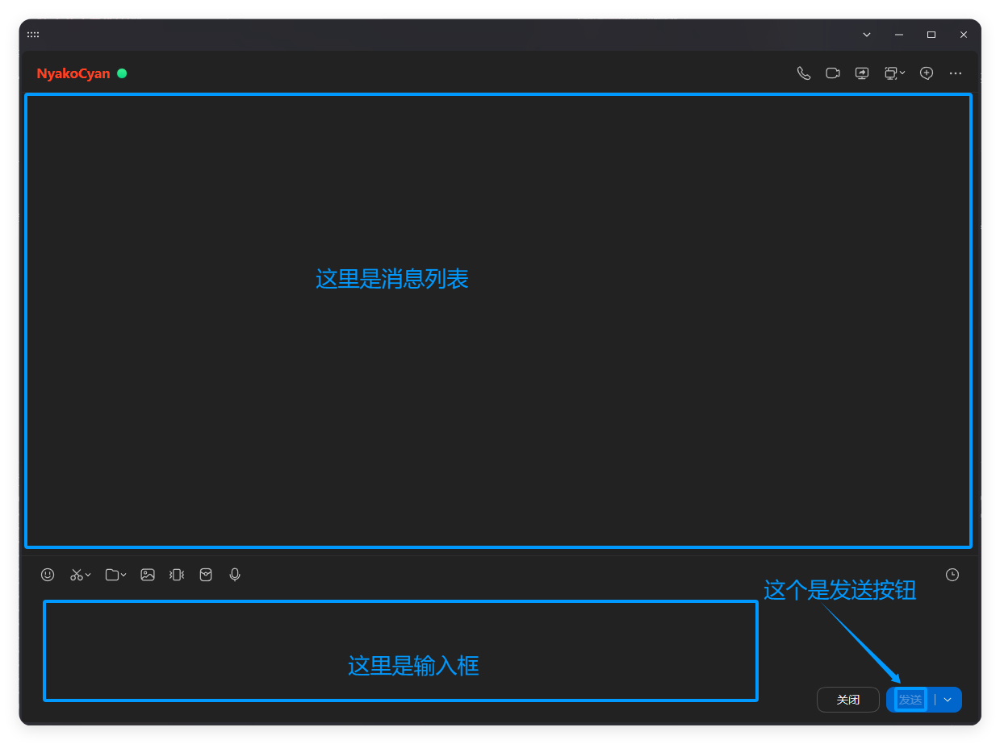

# QQSafeChat

<p align="center">
  
</p>

# 介绍与定位

### QQSafeChat 是一个基于 **Windows UI Automation（UIA）** 的 **QQ 聊天机器人接入** 工具

### **!!!本项目支持让 AI 发送表情包!!!**

为此，创建了一个独立的项目[**StickerSelector**](https://github.com/TheD0ubleC/StickerSelector/)。使用本地微型 AI 模型 `m3e-small` 根据 AI 生成的表情包描述与多个您添加的表情包及其描述词进行向量空间的位置对比来选取最合适的表情包。

---

- 🧀 通过 **绑定控件**（消息列表 / 输入框 / 发送按钮）实现稳定操作

- 🧀 非常安全的聊天读取

  - 不注入
  - 不抓协议
  - 不扫描内存

- 🧀 模拟最真实的人类聊天
  - 模拟打字
  - 正确触发“对方正在输入” 【!!!此功能还未进行测试，即将开放!!!】
  - 消息分段发送
  - 发送表情包

---

.....懒得写了 将就看看吧 到时候再补

首先只支持 qq9.0 以上

### StickerSelector 项目部署、使用方式请去[项目仓库](https://github.com/TheD0ubleC/StickerSelector/)。

### 非常重要的事情：

- 如果出现选择不上组件 选择的是整个窗口（PaneControl）的问题 [请点击我](#关于只能选择整个窗口)
- 千万不要管理员运行 QQ
- 运行时请不要让 QQ 窗口被任何东西遮挡 最好关闭系统通知
- 启动后如果焦点到了其他程序上 消息可能会被中断
- `QQSafeChat`本身非常轻量 推荐在至少`1.5GB RAM + 1 核心`的`WinServer`上运行（已包含 QQNT 所需的资源）以防被其他程序获得焦点后中断回复

部署方式：
先安装依赖 我用的是 python3.10.6 作为开发环境 暂时不知道其他环境能不能用 总之最好不要低于这个版本

```bash
pip install -r requirements.txt
```

如果依赖安装没问题 则可以启动

```
python app.py
```

没了

运行时：

使用时把那三个要绑定的东西拖到 qq 窗口对应的组件上


每次启动前都需要右键点击消息区 然后清屏


推荐用 `真实女友-基础` 这个人格 我个人感觉是最好的

> （我不会写 prompt 都是 ai 写的 但只有那个效果最好 她的分支也还可以 TT）

---

## 关于只能选择整个窗口

#### 这个问题一般出现在没有`GPU`的设备上

`QQNT`使用的是 Web 桌面框架`Electron/Chromium`开发的 在无 GPU 的设备上不会默认启用构建`Chromium Accessibility`
而需要强制开启它 只需要使用`--force-renderer-accessibility`命令来启动 QQ 即可 比如这样

```bash
QQ.exe --force-renderer-accessibility
```

我推荐在快捷方式后加上这条参数 如需使用QQ自启动也需要在自启动快捷方式上增加这条参数

原始 Issue：https://github.com/TheD0ubleC/QQSafeChat/issues/1
